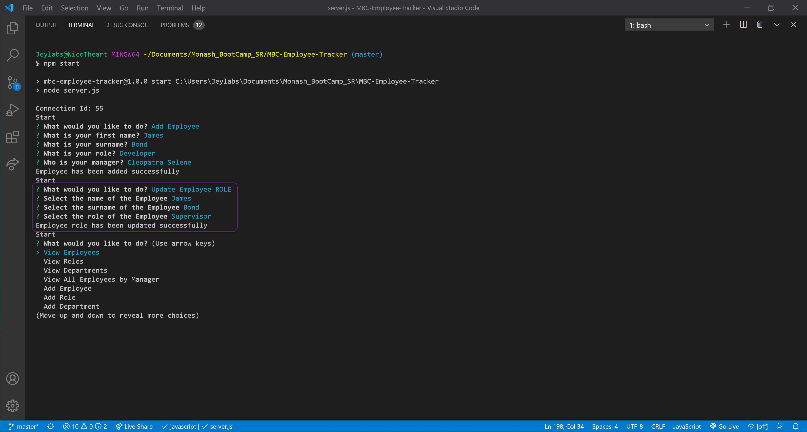

# MBC-Employee-Tracker

## Application & Repository Link

###### [Application Demo](https://drive.google.com/file/d/1oKntvY9yuWQ0UGPdl37qX0hO6DrrAfu3/view?usp=sharing)

###### [Repository Link](https://github.com/Suji-GitH/MBC-Employee-Tracker)

## Content
- [Overview](#Overview)
- [Acceptance Criteria](#Acceptance-Criteria)
- [Application Screens](#Application-Screens)
- [Installation](#Installation)
- [Credits](#Credits)
- [Testing](#Testing)

## Overview

```
As a business owner
I want to be able to view and manage the departments, roles, and employees in my company
So that I can organize and plan my business
```

## Acceptance Criteria

* Add departments, roles, employees
* View departments, roles, employees
* Update employee roles

## Installation

1. Download/Clone this GitHub repository.
2. Install dependencies via npm (inquirer and mysql). 
3. Run schema.sql and seed.sql from sql_base file to set up your database. If you have your own data, please make sure the columns match the schema and import the file. 
4. Run the app through node.j by node server.js.

## Application-Screens

###### App Screenshots

Initiate App


View Tables


Add Functionality Sample(Employee)


Update Functionality Sample(Employee Role)


Delete Functionality Sample(Employee)
- Highlighted in red the record that was removed


View Budget


## Credits

- npm inquirer
- npm mysql
- npm dotevn
- mySQL Workbench 8.0
- node.js

## Testing

Only positive path scenario have been tested. 

```
Given that application is initiated, user is displayed with selectable list of "View Employees, View Roles, View Departments, View All Employees by Manager, Add Employee, Add Role, Add Department, Update Employee ROLE, Update Employee MANGER, Delete Employee, Delete ROLE, Delete DEPARTMENT, View Department Budgets, Exit"

Given that user selects view employees, user is displayed with employee table with corresponding role name and department name.

Given that user selects view roles, user is displayed with role table with id, title, salary and corresponding department.

Given that user selects view department, user is displayed with department table with id and department name.

Given that user selects add employees, user is prompted to input first name, last name, select role and department, then employee is added.

Given that user selects add role, user is prompted to input title, salary, and select department, then role is added.

Given that user selects add department, user is prompted to department name, then department is added.

Given that user selects update employee role, user is prompted to select an employee and select new role, then employee role is updated.

Given that user selects update employee manager, user is prompted to select an employee and select new manager, then employee manager is updated.

Given that user selects delete employee, user is prompted to select an employee and employee is deleted.

Given that user selects delete role, user is prompted to select an role and role is deleted.

Given that user selects delete department, user is prompted to select an department and department is deleted.

Given that user selects view department budget, user is prompted to select an department and total salary for the department is shown.

Given that user selects exit, application is closed. 
```